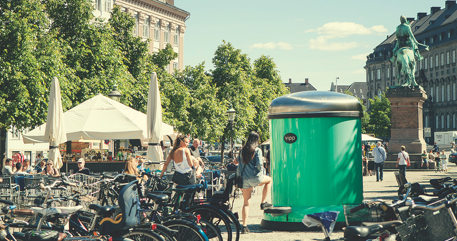

pedaalemmer
===========

## What is this?

A personal repository to keep code, resources, snippets and draft texts or projects for experimentation and development in Pedestal. Conceptual familiarization, learning, reconnaissance, idea generation, those kind of things. Also will contain manual/documentation resources and assets like screenshots, notes, presentations, possible a video or two.

## The name?

Dutch for 'pedal bin'. I had to come up with *some name* didn't I? This was the first thing that
popped up, you'd think it has something to do with the 'ped' although there are other associations
one could have made that would have been less fortunate perhaps:

> Remember that the Greek ped- means "child" while the Latin ped- means "foot".

So our case, it's the latter. I was lucky to intuitively realize this difference, else I might had just picked pedagog as a name. Or worse. Also, somehow I managed to find a picture that can go with it.

## License

Just like Clojure and Pedestal, keep that in mind as I don't intend to copy paste 200 License declarations. If you feel I must because some of it is *YOUR* work and you have some unexplainable
need to tag everywhere that you made it, let me know and I'll add it whereever you want.
